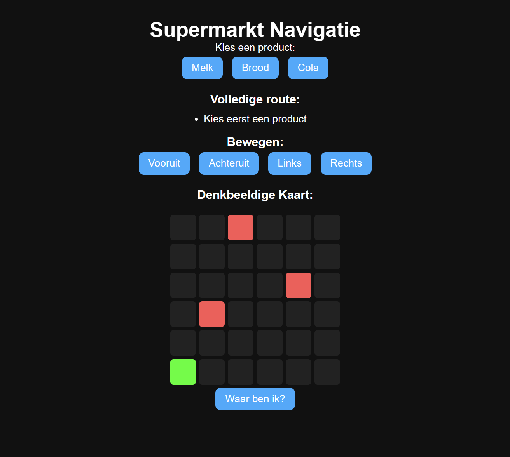
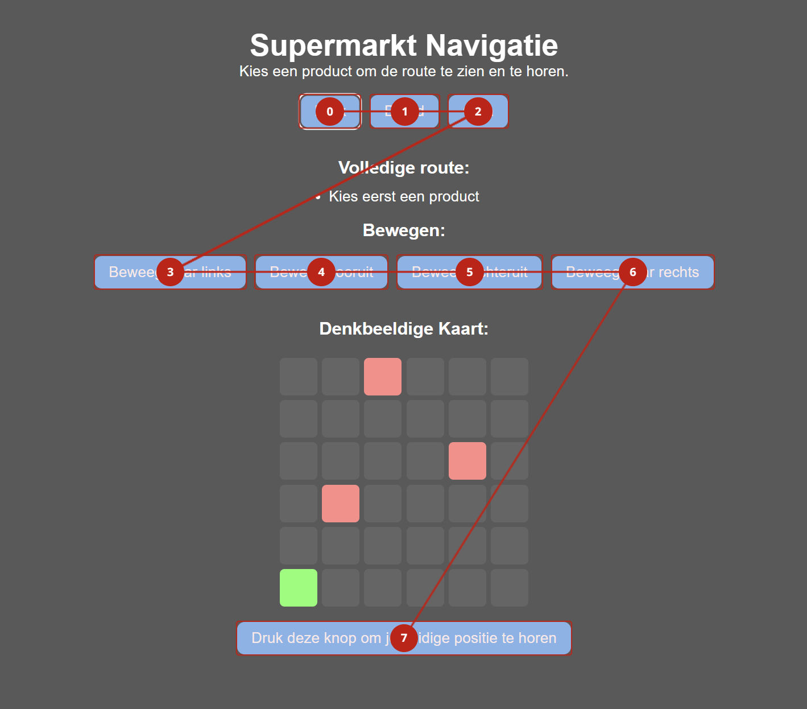

# HCD-Dylan

## Dag 1 (30 maart)

### Opdracht
Vandaag hebben we de kickoff gehad voor HCD. We moeten voor 1 specifieke persoon een website ontwerpen. Ik ben ingedeeld met Berend. Hij houdt zich bezig met Indoor Navigatie, is ervaringsprofessional bij Stichting Accessibility en is blind. Verder kan ik kiezen uit 4 themas: 

- Nuance
- Verwarring
- Voorkeuren
- Spraakberichten

### Wat is Indoor Navigatie?
Indoor navigatie is een technologie die gebruikers via een smartphone-app helpt bij het vinden van hun weg in gebouwen, zoals stations, ziekenhuizen of kantoorpanden

Bron: https://www.interact-lighting.com/nl-nl/capabilities/indoor-navigation

Het is in principe GPS maar binnen ipv buiten op de weg. Bv. navigatie tijdens boodschappen halen.

### Werkzaamheden
Ik heb nog niet gesproken met Berend. Hij heeft blijkbaar focus op Indoor Navigatie, maar ik weet niet of ik mijn website daarover wil maken. Voor een GPS moet je rekening houden met locatie, wifi, bluetooth etc. vooral binnen een gebouw. Verder kan het zijn dat hij liever wat anders wil zien dan waar hij nu mee bezig is.

Een ander idee die ik heb is om online eten te bestellen en dit zo makkelijk mogelijk te kunnen maken voor Berend.

Ik ben vandaag in ieder geval begonnen met mijn repo in elkaar zetten. Deze online te zetten op Github en te delen in Teams, de bestanden te maken etc. Verder heb ik de Taba11y extensie gedownload en screen reader getest door mijn Narrator aan te zetten op mijn laptop.

Ik ben begonnen aan een Indoor Navigatie systeem. Deze vindt plaats in een supermarkt. Je hebt de keuze uit 3 producten. Elk product heeft een eigen locatie. Vervolgens wordt je naar de juiste locatie geleid. 

Omdat ik niet op mijn Github website een werkende GPS kan maken die op mobiel werkt en je huidige locatie kan volgens (of misschien kan dat nog) heb ik nu op de website een 6x6 grid gemaakt die om het idee te schetsen hoe je kan bewegen van plek naar plek en waar de producten staan. Elk product heeft een locatie op het grid en een eigen knop. Als je op deze knop drukt krijg je te zien hoeveel stappen je nog moet zetten naar voor/achter en naar links/rechts. 

Daarnaast is er nog een waar ben ik knop. Omdat je niet voor elke stap een lang bericht wil aanhoren waar je bent, lijkt het mij handig om de gebruiker alleen de info te geven als hij/zij daar echt naar op zoek is.

Ik heb gesproken met Vasilis. Hij vindt het wel een leuk idee. Wat belangrijk is is dat de gebruiker de website gaat bekijken op zijn eigen device, dus deze online moet staan op Github en dat hij moet blijven snappen waar hij is op de site. Verder moet ik nog kennis opdoen over screen readers. Op Desktop gebruiken veel mensen screen reader NVDA en op mobiel gebruiken ze Voice Over (op IOS). Hier ga ik nog naar kijken.

### Weekly Geek Exclusive Design + Flipping Things
Voor deze weekly geek zijn 2 artikelen: Exclusive Design by Vasilis Gemert & Flipping Things

<strong>Exclusive Design</strong>
Wij ontwerpen 25 jaar websites voor mensen die zelf websites ontwerpen
Maar wat als we alleen maar voor mensen met beperkingen ontwerpen?
Exclusieve design principes dienen als het tegenovergestelde van inclusieve design principes

4 Exclusieve design principes:
- Study Situation: Snappen we de gebruikers wel? Eerst hun beperkingen ervaren en begrijpen, daarna pas ontwerpen
- Ignore Conventions: Deze conventions houden toch geen rekening met mensen met beperkingen? Waarom dan wel andersom?
- Prioritise identity: Laat gebruikers een actieve rol spelen in het ontwerpproces. We ontwerpen niet alleen VOOR maar ook MET de gebruikers.
- Add nonsense: Ontwerpen moet meer dan alleen functioneel zijn. Geef ruimte voor creatieve en leuke ideeen.

Waarom doen we dit? Omdat we een verschil kunnen maken. Mensen met beperkingen kunnen onafhankelijk gebruik maken van jouw product. Andere redenen zijn meer mensen = meer klanten en het volgen van de wetten, zodat je geen boetes hoeft te betalen.

<strong>Flipping Things</strong>
Er is verschil tussen kennis over ontwerpen voor jezelf dan voor iemand anders.
Er is meer achter toegankelijkheid dan "technical conformance" oftewel alle normen voldoen

Voor 4 (van 7) principes van Alla Kholmatova heeft Vasilis een omgekeerde principe voor exclusief design toegepast.
- Consider all contexts → Study situation: Als we met ALLES rekening houden, moeten we wel over ALLES de nodige kennis hebben. Dit kun je pas leren door op een individu te focussen en zijn/haar context.
- Be consistent → Ignore conventions: Als alles consistent blijft, betekent dat niet dat het is wat de gebruiker wil.
- Prioritise content → Prioritise identity: Als je alleen focust op content heb je niet de inzichten die je kunt krijgen zonder de identiteit te includeren. 
- Add value → Add nonsense: Als we de 3 voorgaande punten gehad hebben, betekent dat niet dat we alles weten van de gebruiker. Met nonsense kun je tot nieuwe inzichten komen.

### Checkout met Lisa
Vandaag werd ik gerandomized met Alexia. Ik heb het gevoel dat ik de afgelopen 10 keer iemand heb gehad die niet aanwezig is maar ik ben uiteindelijk samen gezet met Lisa. Zij heeft Darice: een dove die graag podcast of films wil ervaren zonder de audio te kunnen horen. Als iemand iets verteld moet het duidelijk zijn of deze stem hard/zacht, vrolijk/boos enz. is. Deze had ik ook graag willen doen. Ik heb laten zien wat ik heb. Morgen ben ik van plan om mijn prototype meer screen reader friendly te maken. Verder wil ik meer de indeling van een echte supermarkt toepassen.

## Dag 2 (31 maart)
### Een rant over mijn ochtend
Vandaag had ik geen goede ochtend. Ik ben al een tijdje verkouden, de parkeerplek waar ik altijd met de auto naartoe ga was dicht toen in aan kwam rijden en dinsdag is al een dag waar veel mensen daar moeten zijn. Blijkbaar was er gisteravond een overledene gevonden op die parkeerplaats. Ik moest ergens een woonwijk vinden met een parkeerplaats, maar overal zit het vol of kun je max 2h parkeren. Ik had uiteindelijk een plaats gevonden waar nog 1 plek beschikbaar was. Geen idee hoe, maar ik had mijn trein alsnog gehaald door nog te rennen naar station. Ik kwam nog net op tijd op school, anders was het essay schrijven...

Artikel over wat is er is gebeurd:
https://www.hcnieuws.nl/112/112/126155/overleden-persoon-aangetroffen-op-parkeerplaats-bij-station-n

### Werkzaamheden
Anyways vandaag begonnen we met de weekly geek van vasilis en hadden we een wooclap gedaan. Ik denk dat ik veel van de vragen wel goed had, het ging dit keer ook veel meer over de inhoud. Vervolgens kwamen de testpersonen. Berend is er pas om 15.00 dus ik heb bijna de hele dag buiten het lokaal gewerkt.

Vandaag was niet mijn meest productieve dag. Mijn focus was niet heel hoog. ben ik bezig geweest met mijn prototype meer screen reader friendly te maken. Ik heb gebruik van aria-live. Hier wist ik nog niet veel over dus ik heb wat kennis opgedaan op mozilla, link in bronnenlijst. 

Ik ben mijn onderdelen langsgegaan om te zien wat meer screen reader friendly kan. Ik had eerst veel aria labels neergezet, maar omdat dit een site is voor alleen de persoon die een screen reader gaat gebruiken is het net zo makkelijk om dit als normale tekst neer te zetten. Bijvoorbeeld ipv een knop met "Vooruit" is het "Neem een stap vooruit".

Ik heb bijvoorbeeld een aria-assertive gezet 

Verder heb ik nog wat testen gedaan met Taba11y. Ze staan nu gewoon op chronologische volgorde. Als je tabt heb je eerst de knoppen om een product te kiezen, daarna de knoppen om te bewegen en onderaan de knop om je eigen locatie op te halen.

Om 15:00 had ik mijn testmoment met Berend samen met mijn groepje.'
Een aantal vragen voor die ik heb zijn:
- Wat is uw ervaring met navigatie en/of Indoor Navigation?
- Bent u geintereseerd in een prototype over Indoor Navigation?
- Wat voor screen reader(s) gebruikt u?
Verder ben ik wel benieuwd hoe een normale dag voor hem eruit ziet dus ik zal daar vast ook wel naar vragen.

### Notities test met Berend
Dit zijn al mijn notities die ik heb gemaakt tijdens mijn test met Berend, zowel uit mijn eigen test als van andere studenten.

NVDA screen reader op laptop

NVDA (gratis, desktop)
Jaws (duur, desktop) meeste gebruiken mensen niet
talkback (Voor Android)
voice over (Voor IOS)

Hij gebruikt NVDA voor desktop en Talkback voor mobiel
Zijn devices zijn desktop en mobiel.

Berend ziet wel kleuren, maar ipv personen meer stippen. Hij ziet een grote vlek en kan er soort van omheen kijken.
Niet altijd al blind, het begon bij overgrootmoeder en is gebleven in de genen. Het is sinds hij 10 jaar is. Hij kijkt wel naar het scherm, maar ziet weinig.

Hij heeft een grote groene vierkant die hij op scherm kan hebben, kan zoomen en laten voorlezen.

Zijn email: berend@berendconnect.nl

meeste blinden kennen hun supermarkt uit hun hoofd

Chill dat dit duidelijk is omschreven. Losse app situatie. Het is belangrijk dat het gelijk duidelijk waar de site over gaat.

Hij zegt alle selecties in zijn navigatie. Werkt wel normaal

Beste sites zijn illegaale streaming sites want ze zijn lekker simpel en doen niks verwarrends 

dezelfde lijn maar apart gelezen.

Kleuren worden omgedraaid en ziet mijn grid niet. (hij kan dat fixen)

Niet veel toegevoegde aan de grid. Hij snapt wel dat het leuk is. Misschien wat meer contrast er in.

Als je een 2e keer op de waar ben ik knop drukt moet hij wel nog een keer melden.

Advies voor nienke: maak 1 blok van een chat + datum. Stop en start spraakopname op dezelfde knop zetten. Nog niet genoeg feedback zoals: je bent nu geluid aan het opnemen, je kunt naar onder om je bericht te beluisteren etc.

Einde van de pagina is een prima plek voor een button, waar ben ik knop kan daar goed blijven want hij kan sne naar het einde van HTML.

Denk aan sneltoetsen van NVDA: 
Hij heeft zelf ook custom keybinds

### Checkout met Aya A
Vandaag zijn we pas om 17.00 klaar dus heb ik samen met iemand uit mijn groepje de checkout gedaan. Ik heb de checkout met Aya A gedaan. Zij heeft het idee om tijdens een tekst te lezen met screen reader de optie te geven om te stoppen waar je bent gebleven, later terug kan komen en vervolgens verder kan waar hij/zij is gebleven. Ik heb laten zien wat ik had, ze vond het wel een leuk idee.

## Week 1 Overzicht 
Deze week ben ik begonnen aan mijn project. Ik heb gekozen voor onderdeel verwarring met als thema een indoor navigation om boodschappen te halen bij een supermarkt. Ik ben benieuwd hoe complex ik dit proces kan maken maar als nog te volgen is met een screen reader. Denk aan meerdere gangpaden, meerdere producten op 1 locatie met verschillende verdiepingen etc.

Ik heb nu een prototype waarin je eerst een product kunt kiezen welk product je wil. Je kunt kiezen uit brood, melk & cola. Vervolgens kom je te weten hoeveel stappen je moet nemen naar voren/achter (Y) en hoeveel stappen naar links/rechts (X). Er is een overzicht van alle locaties (zowel jezelf als de procucten) in een grid. Deze is 6x6. Het grid was in eerste instantie bedoeld voor mezelf, maar omdat Berend wel iets kan zien en ook inzoomt op de inhoud. Daarnaast zijn er de 4 knoppen om een stap te nemen in de bijhorende richting en is er onderin een knop die de gebruiker verteld waar hij zich op dit moment bevindt. Bijvoorbeeld rij 2 kolum 3.

Verder heb ik deze getest met Taba11y. Daar kwam wel een logische volgorde uit.

Tijdens mijn test ben ik tot een paar conclusies gekomen. Dit zijn de dingen die ik wil doen voor de volgende test
- Knoppen dezelfde rij maar niet allemaal in een keer lezen
- Waar ben ik meerdere keren laten werken
- Kleurcontrast grid. Rood op zwart (blauw op wit) is niet heel goed

Verder heb ik donderdag gesprek met clubje + Vasilis gehad en hij had nog wat tips voor me:
Gebruik ul li button zodat je knoppen misschien apart werken.
Addeventlistener ipv inline inline JavaScript

## Dag 3 (7 april)
### Weekly Geek - Accessibility and the agentic web
Ik heb maandag op 2e paasdag het artikel gelezen over Accessibility and the agentic web door Leonie Watson. Dit is dezelfde persoon waar Vasilis zijn 4 exclusive principes uit heeft gehaald

De enige manier om blind te kunnen shoppen is met een assistent. Weinig winkels hebben een service, dus doen ze het online. Helaas zijn retail websites vaak niet toegankelijk genoeg.

Een blinde heeft meer nodig dan een korte omschrijving voor een zin.(voorbeeld over een zwarte sjaal breiden)

Enter AI.
Screen readers kunnen met AI een beschrijving van een afbeelding genereren. Als mensen het zelf niet op hun site doen moet er wat anders te verzinnen zijn. AI kan een verkeerd beeld hebben van een afbeelding. Daarnaast moet de afbeelding alsnog te vinden zijn voor screen readers.

Enter agentic AI.
Agentic = De AI kan zelf acties uitvoeren ipv alleen antwoorden geven
Een AI assistent die je helpt met producten vinden
Innosearch - Werkt met 500.000 webshops en presenteert producten consistent voor screen readers. Komt ook met info waar je anders apart naar opzoek moet gaan

Exit Websites?
Waarom hebben we retail websites of uberhaupt websites nodig als we een agentic AI de actie kunnen laten doen? 
Websites zullen vast niet verdwijnen maar er zal wel verschil komen
Google AI Search vermindert veel verkeer op websites.

And accessibility?
Zal een agentic web die informatie kan genereren de toegankelijkheid verbeteren of verslechteren? 
Hoe kunnen we weten dat de content toegankelijk is? 
Als je 2x hetzelfde vraagt aan een AI met precies dezelfde prompt krijg je alsnog een ander antwoord.

Eigen mening. AI moet nooit een website vervangen vanwege de inconsistenties maar kan wel als hulpmiddel worden gebruikt bij minder toegankelijke websites als alternatieve oplossing.

Onderaan staat nog wat info over Leonie en wie ze is. En dit artikel is in 8 augustus 2025 geschreven

### Werkzaamheden
Vandaag zijn we begonnen met de Weekly Geek. We hadden dit keer ook een vraag erbij waar je in eigen woorden het statement over Exit websites moet uitleggen. Ik denk dat ik wel een goed antwoord had daarvoor.

Ik ben deze ochtend bezig geweest met de feedback verwerken die ik vorige week heb gekregen. De belangrijkste verbetering is dat ik nu 2 keer op de locatie knop kan drukken en deze 2 keer dezelfde locatie kan voorlezen. Dit heb ik gedaan door eerst de tekst voor 50ms weg te halen en dan weer terug te zetten. 

Verder heb ik geprobeerd om het probleem op te lossen dat hij alle buttons in 1 keer opleest door er list items van te maken. Hiervoor heb ik NVDA geinstalleerd om dit te kunnen testen. Het werkt, alles wordt opgelezen, alleen omdat mijn laptop in het Engels is leest hij alle tekst met een Engelse stem voor, ondanks mijn site Nederlands is. Gelukkig leest hij voor Berend wel in het Nederlands op, maar ik moet even vragen aan hem hoe ik de taal kan aanpassen aangezien hij zowel Engels als Nederlands kan gebruiken en voor mij in NVDA de Nederlandse stem er niet tussen staat. Melvin heeft toevallig het tegenovergestelde. Zijn site is in het Engels maar zijn laptop is in het Nederlands en zijn screenreader leest dus zijn site in het Nederlands voor. Anyways, het maken van list items heeft het probleem niet opgelost, want hij leest nog steeds alle buttons op (tenzij je uiteraard TAB gebruikt), maar hij verteld nu wel dat een lijst is met X aantal knoppen. Dus dit is wel een stuk beter.

Daarnaast heb ik nog wat kleuren aangepast. Ik had de vorige keer rood en groen op het grid, waarvaan Berend zei dat rood niet goed te zien was op het grid vergeleken met zwart, dus ik heb de vakjes van de producten nu geel gemaakt. Ik vond dat groen en geel wel iets te veel op elkaar leken, dus heb ik de groene aangepast naar paars. (uiteindelijk was dit niet een goed idee, waar ik nog achter kwam tijdens de test.)

### Test met Berend
Hij heeft eem braille toetsenbord meegenomen. Wel interessant om te zien. Dit zou de enige oplossing te zijn voor iemand die zowel blind als doof is.

Braham had grote borders, maar Berend vond ze wel prettig. Die kan ik er ook in doen
Alisha had grote titel, die vond Berend ook wel fijn.

High contrast mode: Hij ziet of mijn grid niet of hij maakt kleuren inverted. Op zich niet iets waar ik veel kan doen, want het zijn specifieke instellingen. Ik mag er een beetje mee kloten.

Maak meerdere paginas

Lichtblauwe knop met witte letters
Paars niet goed te zien tov grijs

Maak een vormpje voor de speler (lichte kleur)

Contrast checkers op zoeken om contrast te zoeken tussen 2 kleuren

Interactie met grid

Laat weten bij welk product je bent aangekomen.

Keybinds

CTRL + NVDA Toets(Insert? misschien TAB) 

Synthesizer NL downloaden

Lettertype boeit niet echt. Liever geen cursief. Het liefst dikgedrukt.

## Week 2 Overzicht
Deze week heb ik maar 1 dag besteed aan HCD aangezien de vrije dagen en ik vooral aandacht moest besteden aan API. Ik ben vooral bezig geweest met de feedbackpunten die ik vorige week van Berend heb gekregen. Ik was hier mee bezig totdat ik om 1 uur de test ging doen met Berend.  

Mijn takeaways voor volgende week zijn: 
- Paars niet goed, zoek ander contrast OF vormpjes
- Goede kleur knoppen maar niet goede witte tekst erin 
- Meer borders (knoppen, secties, grid)
- 2 pagina's
    - 1 pagina om product te kiezen
    - 1 pagina voor het navigeren
- Keybinds
    - Keybinds voor lopen (bv. ALT + SHIFT + Pijltjes)
    - Keybind voor locatie horen (bv. ALT + SHIFT + L)
    - Uitleg voor deze keybinds
- Grotere tekst, altijd beter
- Hoe meer uitleg, hoe beter

## Dag 4 (13 april)
### Werkzaamheden
Vandaag hebben we een 'halve' dag, wat betekende dat ons lokaal niet beschikbaar was. Ik heb er voor gekozen om vanuit huis te werken aangezien ik weinig behoefte heb om de hele dag in de medialounge te zitten. Daarnaast heb ik dinsdag en vrijdag al alle feedback gehad die ik voor nu nodig heb. Morgen is er weer een test dus dan ben ik uiteraard weer op school.

Vandaag wilde ik mijn website op delen in 2 pagina's. Een voor het kiezen van een product en de ander voor de navigatie. Ik heb nu op de eerste pagina (index.html) een overzicht van de 3 producten. Je kunt momenteel 1 van de 3 uitkiezen en vervolgens op een knop drukken om te gaan navigeren. Hier heb ik ook een apart script voor genaamd selection.js.

Daarna heb ik de 2e pagina. Deze heb ik navigatie.html genoemd met erbij de script.html. Nu heb je bovenaan het product al bepaald en kun je gelijk gaan navigeren.

Ik had een tijdje mezelf bezig gehouden met het opschonen van mijn code. Ik had eerst een aparte sectie voor de tekst voor je eigen locatie. Deze is nu hetzelfde als waar de route staat. Dit is een stuk handiger. Verder heb ik nu ook weer wat duidelijkere teksten voor wanneer je een stap neemt. Je komt erachter dat je een stap hebt gezet en dat hoeveel stappen je in elke richting nog moet nemen.

Als laatste heb ik nog keybinds toegevoegd. Je kunt door het grid heenlopen met de pijltoetsen. Omdat de pijltoetsen ook keybinds zijn voor screenreaders heb ik ervoor gezorgd dat je een combinatie moet doen van ALT & de pijltoetsen. Deze uitleg staat ook in de HTML.

### Checkout met Melvin
Vandaag heb ik checkout gedaan met Melvin, aangezien wij allebei vanuit huis hadden gewerkt. Melvin is bezig geweest met annotaties toevoegen aan zijn teksten en hij kan alineas selecteren met TAB. Voor morgen wil ik de styling beter hebben, denk aan contrast en grote letters en misschien meerdere producten tegelijk kunnen zoeken.

## Dag 5 (14 april)
### Werkzaamheden
Vandaag was het weer een testdag. Ik heb van tevoren nog vooral aan styling gezeten. Denk aan contrast, lettergroottes, borders om de sections etc. Verder heb ik een paar posities aangepast van bepaalde paragrafen in sections en zit er nu een knop om terug te gaan naar de index.

### Test met Berend
Aantekeningen test

Dikke borders = niet heel sexy maar wel goed voor Berend

Ik moet nog prefers high contrast filter toevoegen zodat de kleuren voor hem ook kloppen.

Bij het bepalen van tekstgroottes:
Hoeveel informatie kan iemand zien en welke informatie is er allemaal nodig?

Meer headings toevoegen (waarschijnlijk)

Grote tekst is nice maar alleen als het op maar 1 regel blijft. Dus SUPERMARKT NAVIGATIE op 1 regel. 

GEBRUIK GEEN ALT + PIJLTOETSEN, GEBRUIK WAT ANDERS

Groene misschien een klein beetje leger.

Liever gelijk naar de volgende pagina (HOEFT NIET, WANT IK GA MEERDERE PRODUCTEN DOEN)

Meerdere items zou leuk zijn.

Heading bij de terug pagina.
Button IN heading 3.
h2-a-/h2

Duidelijke boxes. Hij snapte de controls en de feedback bij lopen.

De knoppen maken net als op een toetsenbord
Dus:
      OMHOOG
LINKS OMLAAG RECHTS

## Bronnenlijst

Indoor Navigatie
Link: https://www.interact-lighting.com/nl-nl/capabilities/indoor-navigation

Stichting Accessibility
Link: https://www.accessibility.nl/?gad_source=1&gad_campaignid=20220834180&gbraid=0AAAAADP8R64d3G8e6LeRgA0Rysk7n0ar-&gclid=CjwKCAjwvqjOBhAGEiwAngeQnSMX7JWa8KOsqtITMb0G4IIVOogueX39KIK0ZYO7-1PV6QXL7Ipu6xoCN08QAvD_BwE

Exclusive Design
Link: https://exclusive-design.vasilis.nl/

aria-live
Link: https://developer.mozilla.org/en-US/docs/Web/Accessibility/ARIA/Reference/Attributes/aria-live
